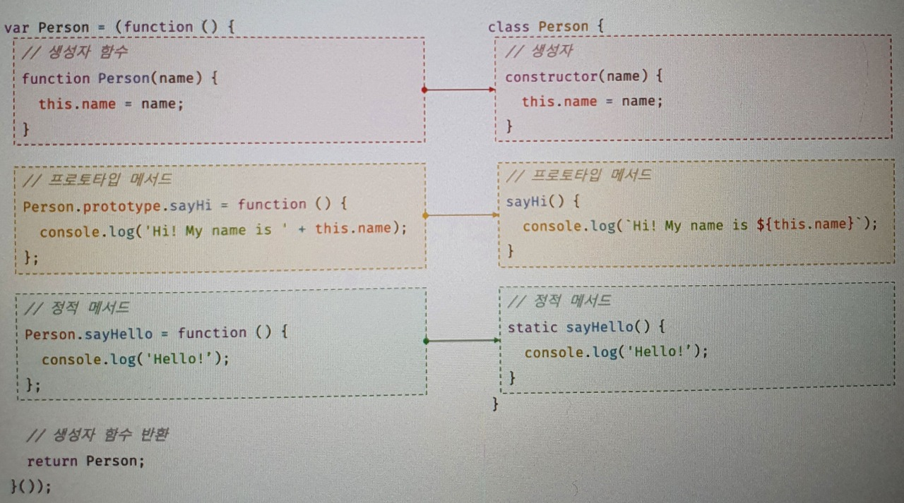

# 클래스

## 1. 클래스는 프로토타입의 문법적 설탕인가?

자바스크립트는 프로토타입 기반 객체지향 언어이다.
프로토타입 기반 객체지향 언어는 클래스가 필요 없는 객체지향 프로그래밍 언어입니다.

Es5에서는 클래스 없이도 생성자 함수와 프로토타입을 통해서 객체지향 언어의 상속을 구현할 수 있다.

```javascript
var Person = (function () {
  // 생성자 함수
  function Person(name) {
    this.name = name;
  }

  // 프로토타입 메서드
  Person.prototype.sayHi = function () {
    console.log("Hi! My name is " + this.name);
  };

  return Person;
})();

// 인스턴스 생성
var me = new Person("Lee");
me.sayHi(); // Hi! My name is Lee
```

<br>

하지만 클래스 기반 언어에 익숙한 프로그래머들이 프로토타입 기반 프로그래밍 방식에 혼란을 느끼면서 JS의 하나의 장벽처럼 느껴졌다.

ES6에서 클래스가 도입되었고 클래스 기반 객체지향 프로그래밍 언어와 매우 흡사하게 새로운 객체 생성 메커니즘을 제시하였다.

그렇다고 프로토타입 기반 객체지향 모델을 폐지하고 새롭게 클래스 기반 객체지향 모델을 제공하는 것은 아니다.

사실 클래스도 함수이며 기존 프로토타입 기반 패턴을 클래스 기반 패턴처럼 사용할 수 있도록 하는 것이다. -> 문법적 설탕이라고 칭함

단 클래스와 생성자 함수는 모두 프로토타입 기반의 인스턴스를 생성하지만 정확히 동일하게 동작하지는 않고 클래스가 더 엄격하며 제공하는 기능도 더 많다.

<br>

### 1.1 클래스와 생성자 함수의 차이점

1. 클래스를 new 연산자 없이 호출하면 에러가 발생한다. 하지만 생성자 함수를 new 연산자 없이 호출하면 일반 함수로서 호출된다.
2. 클래스는 상속을 지원하는 extends와 super 키워드를 제공한다. 하지만 생성자 함수는 extends와 super키워드를 지원하지 않는다.
3. 클래스는 호이스팅이 발생하지 않는 것 처럼 동작한다. 하지만 함수 선언문으로 정의된 생성자 함수는 함수 호이스팅이, 함수 표현식으로 정의한 생성자 함수는 변수 호이스팅이 발생한다.
4. 클래스 내의 모든 코드에는 암묵적으로 strict mode가 지정되어 실행되며 strict mode를 해제할 수 없다. 하지만 생성자 함수는 암묵적으로 strict mode가 지정되지 않는다.
5. 클래스의 constructor, 프로토타입 메서드, 정적 메서드는 모두 프로퍼티 어트리뷰트 [[Enumerable]]의 값이 false다. 다시 말해, 열거되지 않는다.

<br>

## 2. 클래스 정의

클래스는 class 키워드를 사용하여 정의한다.
대체적으로 파스칼 케이스를 사용하고 파스칼 케이스를 사용하지 않는다고 에러가 발생하지는 않는다.

```javascript
// 클래스 선언문
class Person {}
```

<br>

함수와 마찬가지로 표현식으로 클래스를 정의할 수도 있다.
이름을 가질 수도, 갖지 않을 수도 있다.

```javascript
// 익명 클래스 표현식
const Person = class {};

// 기명 클래스 표현식
const Person = class MyClass {};
```

<br>

클래스를 표현식으로 정의할 수 잇다는 것은 클래스가 값으로 사용할 수 있는 일급 객체라는 것을 의미한다.

클래스는 일급 객체로서 다음과 같은 특징을 갖는다.

- 무명의 리터럴로 생성할 수 있다. 즉, 런타임에 생성이 가능하다.
- 변수나 자료구조(객체, 배열 등)에 저장할 수 있다.
- 함수의 매개변수로 전달할 수 있다.
- 함수의 반환값으로 사용할 수 있다.

<br>

클래스 몸체에는 0개 이상의 메서드만 정의할 수 있는데 constructor(생성자), 프로토타입 메서드, 정적 메서드가 있다.

```javascript
// 클래스 선언문
class Person {
  // 생성자
  constructor(name) {
    //인스턴스 생성 및 초기화
    this.name = name;
  }

  // 프로토타입 메서드
  sayHi() {
    console.log(`Hi! My name is ${this.name}`);
  }

  // 정적 메서드
  static sayHello() {
    console.log("Hello!");
  }
}

// 인스턴스 생성
const me = new Person("Lee");

// 인스턴스의 프로퍼티 참조
console.log(me.name); //Lee

// 프로토타입 메서드 호출
me.sayHi(); // Hi! my name is Lee

Person.sayHello(); // Hello!
```



<br>

## 3. 클래스 호이스팅

클래스는 함수로 평가된다.

```javascript
class Person {}
console.log(typeof Personm); // function
```

<br>

클래스 선언문으로 정의한 클래스는 함수 선언문과 같이 런타임 이전에 먼저 평가되어 함수 객체를 생성한다.

이 때 클래스가 평가되어 생성된 함수 객체는 생성자 함수로서 호출할 수 있는 함수, 즉 constructor다.

생성자 함수로서 호출할 수 있는 함수는 함수 정의가 평가되어 함수 객체를 생성하는 시점에 프로토타입도 더불어 생성된다.

프로토타입과 생성자 함수는 단독으로 존재할 수 없고 언제나 쌍으로 존재하기 때문이다.

클래스는 클래스 정의 이전에 참조할 수 없다.

```javascript
console.log(Person); // ReferenceError

class Person {}
```

<br>

클래스 선언문은 마치 호이스팅이 발생하지 않는 것 처럼 보이나 그렇지 않다.

```javascript
const Person = "";
{
  console.log(Person); // ReferenceError

  class Person {}
}
```

let과 const키워드로 선언한 변수처럼 호이스팅된다. 따라서 클래스 선언문 이전에 일시적 사각지대에 빠지기 때문에 호이스팅이 발생하지 않는 것처럼 동작한다.

<br>

## 4. 인스턴스 생성

클래스는 생성자 함수이며 new 연산자와 함께 호출되어 인스터스를 생성한다.

```javascript
class Person {}

// 인스턴스 생성
const me = new Person();
console.log(me);
```

<br>

함수는 new연산자의 사용 여부에 따라 일반 함수로 호출되거나 인스턴스 생성을 위한 생성자 함수로 호출되지만,

클래스는 인스턴스를 생성하는 것이 유일한 존재 이유이므로 반드시 new 연산자와 함께 호출해야 한다.

```javascript
// 클래스를 new 연산자 없이 호출하면 타입 에러가 발생한다.
class Person {}
const me = Person(); // TypeError
```

<br>

클래스 표현식으로 정의된 클래스는 기명 클래스 이름을 사용해 인스턴스를 생성하면 에러가 발생한다.
또한 클래스 표현식에서 사용한 클래스 이름은 외부에서 접근이 불가능하다.

```javascript
const Person = class MyClass {};
const me = new Person();

console.log(MyClass); // ReferenceError

const you = new MyClass(); // ReferenceError
```

<br>

## 5. 메서드

constructor(생성자), 프로토타입 메서드, 정적 메서드 3가지가 있다.

### 5.1 constructor

constructor는 인스턴스를 생성하고 초기화하기 위한 특수한 메서드다. constructor는 이름을 변경할 수 없다.

```javascript
class Person {
  // 생성자
  constructor(name) {
    this.name = name;
  }
}
```

<br>

constructor 내부에서 this에 추가한 프로퍼티는 인스턴스 프로퍼티가 된다. = 생성자 함수와 동일
constructor 내부의 this는 클래스가 생성한 인스턴스를 가리킨다.

```javascript
// 클래스
class Person {
  // 생성자
  constructor(name) {
    this.name = name;
  }
}

// 생성자 함수
function Person(name) {
  this.name = name;
}
```

이 때 클래스가 평가되어 생성된 함수 객체나 클래스가 생성한 인스턴스 어디에도 constructor 메서드가 보이지 않는다.

이는 constructor가 단순히 메서드로 해석되는 것이 아니라 클래스가 평가되어 생성한 함수 객체 코드의 일부가 된다.

다시 말해, 클래스 정의가 평가되면 constructor의 기술된 동작을 하는 함수 객체가 생성된다.

<br>

### constructor 특징

constructor는 클래스 내에 최대 한 개만 존재할 수 있다.
만약 2개 이상이면 문법 에러가 발생한다.

```javascript
class Person {
    constructor() {}
    constructor() {}
}
// SyntaxError
```

<br>

constructor는 생략할 수 있다.

```javascript
class Person {}
```

<br>

constructor를 생략하면 클래스에 빈 constructor가 암묵적으로 정의된다.
constructor를 생략한 클래스는 빈 constructor에 의해 빈 객체를 생성한다.

```javascript
class Person {
  // constructor는 생략하면 아래와 같이 빈 constructor가 암묵적으로 정의된다.
  constructor() {}
}

// 빈 객체가 생성된다.
const me = new Person();
console.log(me); // Person {}
```

<br>

프로퍼티가 추가되어 초기화된 인스턴스를 생성하려면 constructor 내부에서 this에 인스턴스 프로퍼티를 추가한다.

인스턴스를 생성할 때 클래스 외부에서 인스턴스 프로퍼티의 초기값을 전달하려면 constructor에 매개변수를 선언하고 인스턴스를 생성할 때 초기값을 전달한다.

```javascript
class Person {
  constructor(name, address) {
    // 전달받은 인수로 인스턴스 초기화
    this.name = name;
    this.address = address;
  }
}

// 인수로 초기값을 전달한다. constructor에 전달된다.
const me = new Person("Lee", "Seoul");
console.log(me);
```

<br>

constructor는 별도의 return문을 갖지 않아야 한다. new 연산자와 함께 클래스가 호출되면 암묵적으로 this를 반환하기 때문이다.

만약 this가 아닌 다른 객체를 명시적으로 반환하면 this를 반환하지 못하고 명시한 객체가 반환된다.

```javascript
class Person {
  constructor(name) {
    this.name = name;

    return {};
  }
}

const me = new Person("Lee");
console.log(me); // {}
```

<br>

객체가 아닌 원시값을 반환하면 무시되고 암묵적으로 this가 반환된다.

```javascript
class Person {
  constructor(name) {
    this.name = name;

    return 100;
  }
}

const me = new Person("Lee");
console.log(me); // Person{name: "Lee"}
```

따라서 다른 값을 반환하는 것은 클래스의 기본 동작을 훼손하는 것이므로 constructor 내부에서 return 문을 반드시 생략해야 한다.

<br>

### 5.2 프로토타입 메서드

```javascript
// 생성자 함수
function Person(name) {
  this.name = name;
}

Person.prototype.sayHi = function () {
  console.log(`Hi! My name is ${this.name}`);
};

const me = new Person("Lee");
me.sayHi(); // Hi! My name is Lee
```

<br>

클래스는 prototype 프로퍼티에 메서드를 추가하지 않아도 기본적으로 프로토타입 메서드가 된다.

```javascript
class Person {
  // 생성자
  constructor(name) {
    this.name = name;
  }

  // 프로토타입 메서드
  sayHi() {
    console.log(`Hi! My name is ${this.name}`);
  }
}

const me = new Person("Lee");
me.sayHi(); // Hi! My name is Lee
```

<br>

생성자 함수와 마찬가지로 클래스가 생성한 인스턴스는 프로토타입 체인의 일원이 된다.
인스턴스는 프로토타입 메서드를 상속받아 사용할 수 있다.


결국 클래스는 생성자 함수와 같이 인스턴스를 생성하는 생서앚 함수라고 볼 수 있다. 다시 말해 클래스는 생성자 함수와 마찬가지로 프로토타입 기반의 객체 생성 메커니즘이다.

<br>

### 5.3 정적 메서드

정적 메서드는 인스턴스를 생성하지 않아도 호출할 수 있는 메서드를 말한다.

생성자 함수의 경우 정적 메서드를 생성하기 위해서는 명시적으로 생성자 함수에 메서드를 추가해야 한다.

```javascript
// 생성자 함수
function Person(name) {
  this.name = name;
}

// 정적 메서드
Person.sayHi = function () {
  console.log("Hi!");
};

// 정적 메서드 호출
Person.sayHi(); // Hi!
```

<br>

클래스에서는 메서드에 static 키워드를 붙이면 정적 메서드가 된다.

```javascript
class Person {
  // 생성자
  constructor(name) {
    this.name = name;
  }

  // 정적 메서드
  static sayHi() {
    console.log("Hi!");
  }
}
```

<br>
위 예제의 Person 클래스의 프로토타입 체인


이처럼 정적 메서드는 클래스에 바인딩 된 메서드가 된다. 클래스는 함수 객체로 평가되므로 자신의 프로퍼티/ 메서드를 소유할 수 있다.

클래스는 클래스 정의가 평가되는 시점에 함수 객체가 되므로 인스턴스와 달리 별다른 생성 과정이 필요 없다.

따라서 정적 메서드는 클래스 정의 이후 인스턴스를 새엇ㅇ하지 않아도 호출할 수 있다.

인스턴스의 프로토타입 체인 상에는 클래스가 존재하지 않기 때문에 인스턴스로 호출할 수 없다.

```javascript
const me = new Person("Lee");
me.sayHi(); // TypeError
```

<br>

### 5.4 정적 메서드와 프로토타입 메서드의 차이

1. 자신이 속해있는 프로토타입 체인이 다르다.
2. 정적 메서드는 클래스로 호출하고 프로토타입 메서드는 인스턴스로 호출한다.
3. 정적 메서드는 인스턴스 프로퍼티를 참조할 수 없지만 프로토타입 메서드는 인스턴스 프로퍼티를 참조할 수 있다.

<br>

정적 메서드를 사용할 때는 인스턴스 프로퍼티를 참조하지 않는다.

```javascript
class Square {
  // 정적 메서드
  static area(width, height) {
    return width * height;
  }
}

console.log(Square.area(10, 10));
```

<br>

프로토타입 메서드를 사용할 때는 인스턴스의 프로퍼티를 참조한다.

```javascript
class Square {
  constructor(width, height) {
    this.width = width;
    this.height = height;
  }

  // 프로토타입 메서드
  area() {
    return this.width * this.height;
  }
}

const square = new Square(10, 10);
console.log(square.area()); // 100
```

정적 메서드는 클래스로 호출해야 하므로 정적 메서드 내부의 this는 인스턴스가 아닌 클래스를 가리킨다.

따라서 메서드 내부에서 인스턴스 프로퍼티를 참조할 필요가 있다면 this를 사용해야 하며, 이럴 경우 프로토타입 메서드로 정의를 해야한다.

하지만 메서드 내부에서 인스턴스 프로퍼티를 참조해야 할 필요가 없다면 this를 사용하지 않아도 되기 때문에 정적 메서드를 정의하는 것이 좋다.

<br>

### 5.5 클래스에서 정의한 메서드의 특징

1. function 키워드르 생략한 메서드 축약 표현을 사용한다.
2. 객체 리터럴과는 다르게 클래스에 메서드를 정의할 때는 콤마가 필요 없다.
3. 암묵적으로 strict mode로 실행된다.
4. for...in 문이나 Objet.keys 메서드 등으로 열거할 수 없다. 즉 프로퍼티 어트리뷰트 [[Enumerable]]의 값이 false다.
5. 내부 메서드 [[Construct]]를 갖지 않는 non-constructor다. 따라서 new 연산자와 함께 호출할 수 없다.

<br>

## 6. 클래스의 인스턴스 생성 과정

1. 인스턴스 생성과 this바인딩

- new 연산자와 함께 클래스를 호출하면 암묵적으로 빈 객체(인스턴스)가 생성된다.
- 빈 객체는 this에 바인딩 된다.

2. 인스턴스 초기화

- constructor 내부의 코드가 실행되며 this에 바인딩되어 있는 인스턴스를 초기화한다.
- 인스턴스에 프로퍼티를 추가하고 초기화한다.

3. 인스턴스 반환
   클래스의 모든 처리가 끝나면 완성된 인스턴스가 바인딩된 this가 암묵적으로 반환된다.

```javascript
class Person {
  // 생성자
  constructor(name) {
    // 1. 암묵적으로 인스턴스가 생성되고 this에 바인딩된다.
    console.log(this);
    console.log(Object.getPrototypeOf(this) === Person.prototype); // true

    // 2. this에 바인딩되어 있는 인스턴스를 초기화한다.
    this.name = name;

    // 3. 완성된 인스턴스가 바인딩된 this가 암묵적으로 반환된다.
  }
}
```

<br>

## 7. 프로퍼티

### 7.1 인스턴스 프로퍼티

constructor 내부의 this는 앞서 봤듯이 클래스가 생성한 빈 객체(인스턴스)가 바인딩 되어있다.

따라서 this.name = name; 코드가 실행되면 this에 인스턴스 프로퍼티를 추가하고 초기화한다.

```javascript
class Person {
  constructor(name) {
    // 인스턴스 프로퍼티
    this.name = name;
  }
}

const me = new Person("Lee");
console.log(me); // Person {name: "Lee"}
```

<br>

### 7.2 접근자 프로퍼티

접근자 프로퍼티는 자체적으로는 값([[Value]]내부슬롯)을 갖지 않고 다른 데이터 프로퍼티의 값을 읽거나 저장할 때 사용하는 접근자 함수로 구성된 프로퍼티다.

- getter는 무언가를 취들할 때 사용하므로 반드시 return이 있어야 한다.
- setter는 무언가를 프로퍼티에 할당할 때 사용하므로 반드시 매개변수가 있어야한다.
- 클래스의 메서느는 기본적으로 프로토타입 메서드가 된다. 따라서 클래스의 접근자 프로퍼티도 프로토타입의 프로퍼티가 된다.

```javascript
class Person {
  constructor(firstName, lastName) {
    this.firstName = firstName;
    this.lastName = lastName;
  }

  // fullName은 접근자 함수로 구성된 접근자 프로퍼티다.
  // getter 함수
  get fullName() {
    return `${this.firstName} ${this.lastName}`;
  }

  // setter 함수
  set fullName(name) {
    [this.firstName, this.lastName] = name.split(" ");
  }
}

const me = new Person("Ungmo", "Lee");

// 데이터 프로퍼티를 통한 프로퍼티 값의 참조.
console.log(`${me.firstName} ${me.lastName}`); // Ungmo Lee

// 접근자 프로퍼티를 통한 프로퍼티 값의 저장
// 접근자 프로퍼티 fullName에 값을 저장하면 setter 함수가 호출된다.
me.fullName = "Heegun Lee";
console.log(me); // {firstName: "Heegun", lastName: "Lee"}

// 접근자 프로퍼티를 통한 프로퍼티 값의 참조
// 접근자 프로퍼티 fullName에 접근하면 getter 함수가 호출된다.
console.log(me.fullName); // Heegun Lee

// fullName은 접근자 프로퍼티다.
// 접근자 프로퍼티는 get, set, enumerable, configurable 프로퍼티 어트리뷰트를 갖는다.
console.log(Object.getOwnPropertyDescriptor(Person.prototype, "fullName"));
// {get: ƒ, set: ƒ, enumerable: false, configurable: true}
```

<br>

### 7.3 클래스 필드 정의 제안

자바스크립트의 클래스 몸체에는 메서드만 선언할 수 있다. 클래스 몸체에 클래스 필드르 선언하면 문법 에러가 발생한다.

하지만 최신브라우저(Chrome72이상) 또는 Node.js(버전 12이상)에서는 정상 동작한다.

그 이유는 자바스크립트에서도 인스턴스 프로퍼티를 마치 클래스 기반 객체지향 언어의 클래스 필드처럼 정의할 수 있는 새로운 표준 사양인 “Class field declarations“가 TC39프로세스의 stage 3(candidate)에 제안되어 있기 때문이다.

TC39프로세스
ECMA-262 사양에 새로운 표준 사양을 추가하기 위해 공식적으로 명문화해 놓은 과정이다.
0단계 부터 4단계까지 총 5단계로 구성되어 있다.

stage 3(candidate) 까지 승급한 제안은 심각한 문제가 없는 한 변경되지 않고 대부분 stage 4로 승급되고,
stage 4(finished)까지 승급한 제안은 큰 이변이 없는 이상 차기 ECMAScript 버전에 포함된다.

```javascript
class Person {
  // 클래스 필드 정의
  name = "Lee";
}

const me = new Person();
console.log(me); // Person {name: "Lee"}
```

<br>

클래스 필드를 정의하는 경우 this에 클래스 필드를 바인딩해서는 안된다.

```javascript
class Person {
  // this에 클래스 필드를 바인딩해서는 안된다.
  this.name = ''; // SyntaxError: Unexpected token '.'
}
```

<br>

클래스 필드에 초기값을 할당하지 않으면 undefined를 갖는다.

```javascript
class Person {
  // 클래스 필드를 초기화하지 않으면 undefined를 갖는다.
  name;
}

const me = new Person();
console.log(me); // Person {name: undefined}
```

<br>

인스턴스를 생성할 때 외부의 초기값으로 클래스 필드를 초기화해야 할 필요가 있다면 constructor에서 클래스 필드를 초기화 해야 된다.

하지만 클래스 필드를 초기화할 필요가 있다면 constructor 밖에서 클래스 필드를 정의할 필요가 없다.

어차피 constructor 내부에서 클래스 필드를 참조하여 초기값을 할당해야 하는데 이 때 this에 클래스 필드에 해당하는 프로퍼티가 없다면 자동으로 추가되기 때문이다.

```javascript
class Person {
  name;

  constructor(name) {
    this.name = name;
  }
}
```

```javascript
class Person {
  constructor(name) {
    this.name = name;
  }
}
```

<br>

함수는 일급 객체이므로 함수를 클래스 필드에 할당할 수도 있다.

```javascript
class Person {
  // 클래스 필드에 문자열을 할당
  name = "Lee";

  // 클래스 필드에 함수를 할당
  getName = function () {
    return this.name;
  };

  // 화살표 함수로 정의할 수도 있다.
  // getName = () => this.name;
}

const me = new Person();
console.log(me); // Person {name: "Lee", getName: f}
console.log(me.getName()); // Lee
```

하지만 클래스 필드에 함수를 할당하는 경우 프로토타입 메서드가 아닌 인스턴스 메서드가 돼서 모든 클래스의 인스턴스 프로퍼티가 된다.
따라서 클래스 필드에 함수를 할당하는 것은 권장하지 않는다.

<br>

### 7.4 private 필드 정의 제안

private 필드도 TC39 프로세스의 stage 3(candidate)로 제안되어있다.(class-private-fields)
최신브라우저(chrome 74이상)와 Node.js(버전 12이상)에 이미 구현되어있다.

private필드는 이름 앞에 #을 붙여준다. 참조할 때도 #을 붙여주어야 한다.

```javascript
class Person {
  // private 필드 정의
  #name = "";

  constructor(name) {
    // private 필드 참조
    this.#name = name;
  }
}

const me = new Person("Lee");

// private 필드 #name은 클래스 외부에서 참조할 수 없다.
console.log(me.#name);
// SyntaxError: Private field '#name' must be declared in an enclosing class
```

<br>

private필드에 직접 접근할 수 있는 방법은 없다. 다만 접근자 프로퍼티를 통해 간접적으로 가능하다.

```javascript
class Person {
  // private 필드 정의
  #name = "";

  constructor(name) {
    this.#name = name;
  }

  // name은 접근자 프로퍼티다.
  get name() {
    // private 필드를 참조하여 trim한 다음 반환한다.
    return this.#name.trim();
  }
}

const me = new Person(" Lee ");
console.log(me.name); // Lee
```

<br>

private 필드는 반드시 클래스 몸체에 정의해야 한다. constructor에 정의하면 에러가 발생한다.

```javascript
class Person {
  constructor(name) {
    // private 필드는 클래스 몸체에서 정의해야 한다.
    this.#name = name;
    // SyntaxError: Private field '#name' must be declared in an enclosing class
  }
}
```

<br>

### 7.5 static 필드 정의 제안

static 키워드를 사용하여 static public 필드, static private 필드, static private 메서드를 정의할 수 있는 새로운 표준 사양인 “Static class features”가 TC39 프로세스의 stage 3(candidate)에 제안되어 있다.(static-class-features)
최신 브라우저(chrome 72이상)와 Node.js(버전 12 이상)에 이미 구현되어 있다.

```javascript
class MyMath {
  // static public 필드 정의
  static PI = 22 / 7;

  // static private 필드 정의
  static #num = 10;

  // static 메서드
  static increment() {
    return ++MyMath.#num;
  }
}

console.log(MyMath.PI); // 3.142857142857143
console.log(MyMath.increment()); // 11
```

이처럼 클래스 몸체 내부에 static 필드와 static 메서드를 정의할 수 있다.
