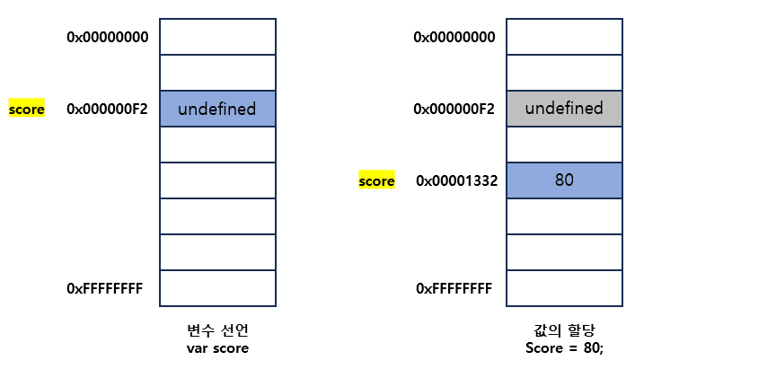

# [4장] 변수

## 변수

하나의 값을 저장하기 위해 확보한 메모리 공간 자체 또는 그 메모리 공간을 식별하기 위해 붙인 이름을 말한다.

변수가 왜 필요할까?

```javascript
10 + 20;
```

## 변수 선언

var, let, const라는 키워드를 통해서 변수를 선언한다.

### var

```javascript
var a; // 선언과 동시에 undefined로 초기화
console.log(a); // undefined
```

그럼 선언과 동시에 값을 초기화해주면?

```javascript
var a = 1; // 선언과 동시에 1로 초기화
console.log(a); // 1
```

자바스크립트 엔진은 변수의 선언과 값의 할당을 2개의 문으로 나누어서 각각 실행한다.
그러므로 첫 번째 메모리 주소에 undefined가 들어가고
두 번째 메모리 주소에 1이 들어간다.

#### 주의해야 할 점



undefined였던 메모리가 1로 변경되는 것이 아닌 새로운 메모리에 저장한다는 것!
undefined가 할당된 불필요한 값들은 가비지 콜렉터에 의해 자동으로 삭제가 돼서 우리가 관리할 필요가 없다.

### let

변하는 값을 선언할 때 사용하는 키워드
재선언 금지, 재할당 가능

```javascript
let a = 1;
let a = 2; // 재선언 금지
```

```javascript
let a = 1;
a = 2; // 재할당 가능
```

<br>

### const

변하지 않는 값(상수)을 선언할 때 사용하는 키워드
재선언 금지, 재할당 금지

```javascript
const a = 1;
const a = 2; // 재선언 금지
```

```javascript
const a = 1;
a = 2; // 재할당 금지
```

<br>

## 호이스팅

```javascript
console.log(score); // undefined
var score;
```

자바스크립트는 인터프리터 언어로 한 줄씩 순차적으로 실행이 된다.
그럼 위 코드에서 console.log()가 먼저 실행이 되기 때문에 참조 에러가 발생해야 하는 거 아닌가?

하지만 오류는 발생하지 않는다.

그 이유는 변수 선언이 소스코드가 한 줄씩 순차적으로 실행되는 시점이 아니라 그 이전 단계에서 먼저 실행되기 때문이다.

## 호이스팅 과정

1. 자바스크립트 엔진이 소스코드를 한 줄씩 순차적으로 실행하기에 앞서 먼저 소스코드의 평가 과정을 거치면서 소스코드를 실행하기 위한 준비를 한다.

2. 이때 자바스크립트 엔진은 변수 선언을 포함한 모든 선언문(변수 선언문, 함수 선언문 등)을 소스코드에서 찾아내 먼저 실행한다.

3. 그리고 평가 과정이 끝나면 비로소 변수 선언을 포함한 모든 선언문을 제외하고 소스코드를 한 줄씩 순차적으로 실행한다.

이 말은 즉, 자바스크립트 엔진은 변수 선언이 소스코드의 어디에 위치하든 상관없이 다른 코드보다 먼저 실행한다. 따라서 어디에 위치한든 상관없이 변수를 참조할 수 있다.

이처럼 변수 선언문이 코드의 선두로 끌어 올려진 것처럼 동작하는 특징을 호이스팅이라 한다. ###한 가지 주의해야 할 점은 평가 과정에서는 할당이 아닌 선언만 한다는 것을 기억해야 한다.

```javascript
console.log(score); // undefined
var score = 80; // 자바스크립트 엔진은 변수의 선언과 값의 할당을 2개의 문으로 나누어 실행
console.log(score); // 80
```

<br>

var 키워드는 선언과 동시에 undefined로 초기화가 이루어짐. let과 const는 초기화를 하지 않음

```javascript
console.log(score); // error score를 초기화하지 않았기 때문
let score = 80;
console.log(score);
```

<br>

## 식별자(변수명) 규칙

- 특수문자를 제외한 문자, 숫자, 언더 스코어(\_), 달러 기호($)를 포함할 수 있다.
- 단 숫자로 시작하는 것은 허용하지 않는다.
- 예약어는 식별자로 사용할 수 없다. (await, const, class 등)

```javascript
var first-name // "_와 $를 제외한 특수문자를 사용하면 안 됨
var 1st // "숫자로 시작하면 안 됨
var this // 예약어를 사용하면 안 됨
```

<br>

### 네이밍 컨벤션

하나 이상의 영어 단어로 구성된 식별자를 만들 때 가독성 좋게 단어를 한눈에 구분하기 위해 규정한 명명 규칙이다.

```javascript
// 카멜 케이스(camelCase)
var firstName;

// 스네이크 케이스(snake_case)
var first_name;

// 파스칼 케이스(PascalCase)
var FirstName;

var strFirstName; // type + identifier
var $elem = document.getElementById("myId"); // DOM 노드
var observable$ = fromEvent(document, "click"); // RXJS 옵저버블
```

자바스크립트에서는 일반적으로 변수나 함수의 이름에는 카멜 케이스를 사용하고, 생성자 함수, 클래스의 이름에는 파스칼 케이스를 사용하니 이 둘을 사용하는 것이 가독성을 높이는데 유리하다.
